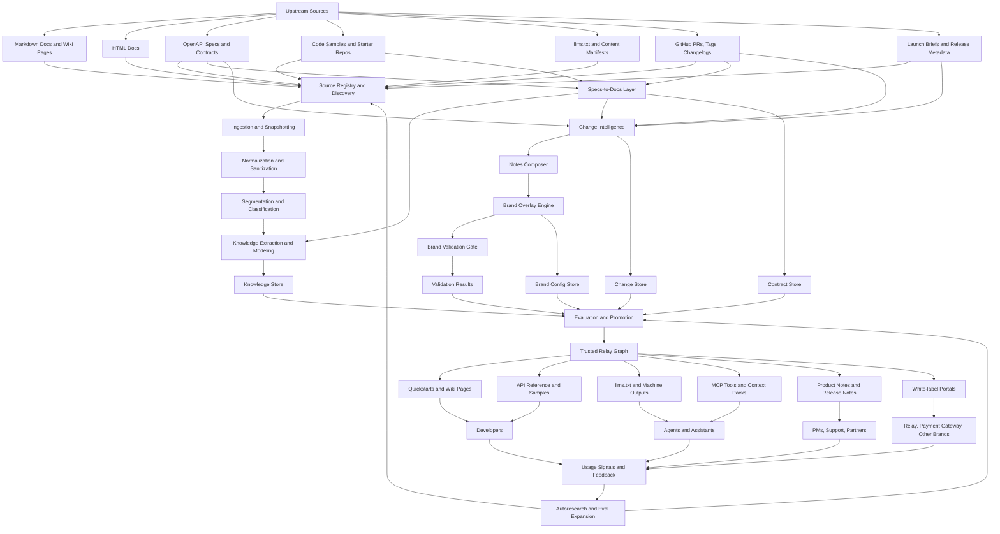

# Plan: Relay Architecture Diagram and Service Decomposition

**ID:** 2026-08-04-003
**Status:** Planned (architecture / decomposition only)
**Scope:** Planning artifact for Relay as a shared content/context engine
**Related plans:**

- `2026-07-25-001` — Relay Bench V0 pipeline
- `2026-08-04-001` — Content Engine V0 local compile slice
- `2026-08-04-002` — Specs-to-Docs V0 local lane

## Honest label

This document captures the target service decomposition and control flows from the Relay architecture diagram.

It does **not** implement or deploy these services in `bench-new`.

Local prototypes in this repo are **in-process modules + artifact files**, used to prove object contracts and promotion gates before any production service split.

## Architecture diagram

## Product framing

Relay is a compiler for developer knowledge:

| Compiler analogy | Relay layer |
|------------------|-------------|
| Source code | Upstream docs, specs, samples, releases |
| Parse / IR | Normalized docs, segments, typed objects, contract entities |
| Tests | Schema, content, contract-alignment, brand, agent-use evals |
| Binaries | Trusted graph outputs: quickstarts, references, notes, MCP packs, llms.txt, brand portals |

Relay is not the chat UI, not a silent rewriter of canonical sources, and not “just RAG.”

## Service map (target)

| Service | Primary responsibility | Key outputs |
|--------|-------------------------|-------------|
| Source Registry Service | Register sources, trust, ownership, refresh rules | Source records, crawl plans |
| Ingestion Service | Fetch/version upstream artifacts | Immutable snapshots |
| Normalization Service | Clean snapshots into stable docs | Normalized markdown + metadata |
| Segmentation Service | Split docs into typed units | Segments, classifications |
| Extraction Service | Prose → typed Relay objects | Quickstart/concept/workflow objects |
| Contract Intelligence Service | Parse specs into contract graph | Contract entities, endpoint maps |
| Docs Composer Service | Spec → reference/quickstart primitives | API reference units, drafts, eval seeds |
| Reconciliation Service | Compare generated vs human content | Drift reports, merge/flag actions |
| Change Intelligence Service | Canonicalize release/code change signals | Change events |
| Notes Composer Service | Audience-specific notes from changes | Product/release/API notes |
| Brand Overlay Service | Late brand rendering + entitlements | Brand-scoped artifacts |
| Validation Service | Schema/content/contract/brand gates | Validation results |
| Eval Orchestrator | Task/agent evals and promotion decisions | Scores, promote/block |
| Promotion Service | Materialize trusted graph updates | Promotion records, rollback points |
| Publishing Service | Distribute trusted artifacts | Portal/MCP/llms.txt/notes feeds |
| Feedback Service | Capture misses and improvement signals | Autoresearch tasks, eval expansions |

## First implementation cut: six deployable domains

Do **not** start with sixteen independently deployed services. Preserve future boundaries inside six domains:

| Deployable domain | Includes | Why |
|------------------|----------|-----|
| Content Intake | Source Registry, Ingestion, Normalization | Shared fetch/prepare concerns |
| Knowledge Compiler | Segmentation, Extraction, object linking | Prose semantic compile lane |
| Contract Compiler | Contract Intelligence, Docs Composer, Reconciliation | Specs-to-docs + drift |
| Change Compiler | Change Intelligence, Notes Composer | Release/product notes lane |
| Trust and Quality | Validation, Eval Orchestrator, Promotion | Central publish gates |
| Delivery Layer | Brand Overlay, Publishing, Feedback | Brand-aware distribute + learn |

### Control flows

#### Specs-to-Docs

1. Spec/code change → Content Intake + Contract Compiler
2. Parse/generate reference artifacts
3. Reconcile vs human docs
4. Trust and Quality (contract fidelity + evals)
5. Delivery publishes approved outputs

#### Release Notes

1. Release/PR/contract diffs → Change Compiler
2. Build change events + audience notes
3. Delivery applies brand overlays
4. Trust and Quality checks brand/publish readiness
5. Delivery publishes notes/feeds/portals

#### Autoresearch

1. Delivery captures misses / broken journeys / brand leaks
2. Feedback expands evals and queues work
3. Knowledge / Contract / Change compilers regenerate affected artifacts
4. Trust and Quality re-gates before re-promotion

## Shared data contracts

Services communicate through stable objects, not one-off payloads:

- `source_record`, `source_snapshot`
- `normalized_document`, `document_segment`
- `relay_document`, `quickstart_unit`, `api_reference_unit`, `api_sample`
- `contract_entity`
- `change_event`, `release_note`
- `brand_overlay`
- `eval_case`, `validation_result`, `promotion_record`

## Map onto `bench-new` today

| Domain | Local proof status |
|--------|--------------------|
| Content Intake | Partial — local registry + content-hashed snapshots (`content_engine`) |
| Knowledge Compiler | Partial — segment/extract quickstart units (DocETL-style) |
| Contract Compiler | Planned — `2026-08-04-002` (not implemented) |
| Change Compiler | Not started |
| Trust and Quality | Partial — schema/content gates + workflow verifier/contract compiler |
| Delivery Layer | Stub — context pack + contract bundle artifacts; no brand overlay/publish |

### What this repo is for

`bench-new` proves **object contracts, lineage, and promotion gates** with frozen fixtures.

It is not the production service mesh.

## Implementation disciplines

1. **Lineage end to end** — every quickstart, reference, note, and branded output must trace to snapshots / contract entities / change events.
2. **Brand rendering stays late** — generate facts once; render Relay / Payment Gateway / other brands many times.
3. **Source truth stays upstream** — Relay writes derived artifacts only.
4. **Evals gate promotion** — structure validity alone is insufficient.
5. **Specs are high-trust inputs, not sufficient outputs** — contracts anchor correctness; workflow/onboarding meaning still needs synthesis.

## Recommended sequencing for this repo

1. Keep Content Engine V0 + Workflow Contract Compiler as the local compiler proof.
2. Implement Specs-to-Docs V0 next (`2026-08-04-002`) as the Contract Compiler domain slice.
3. Add contract-alignment into Trust and Quality before any publish stubs grow.
4. Defer Change Compiler, Brand Overlay, and real Publishing/Feedback services until object contracts are stable.
5. Only then split modules toward the six deployable domains outside this bench.

## Non-goals for this plan PR

- No new services, CLIs, or fixtures
- No GitHub webhook automation
- No brand overlay implementation
- No production Relay / portal / MCP deployment
- No claim that DocETL, Tempo/Harbor, or error-discovery are integrated

## Open questions

1. Which domain becomes the first independently deployable unit after local proofs: Contract Compiler or Trust and Quality?
2. What storage backs Knowledge / Contract / Change stores in production?
3. Which artifact types require human signoff vs automatic promotion?
4. How are intentional contract-vs-guide exceptions modeled?
5. Multi-brand inheritance model across shared / Relay / Payment Gateway layers?

## Recommended decision

Adopt the sixteen-service logical map with a **six-domain first cut**, and continue using `bench-new` to prove shared contracts and promotion gates before service extraction. Prioritize Contract Compiler (specs-to-docs) as the next local lane after Content Engine V0.
