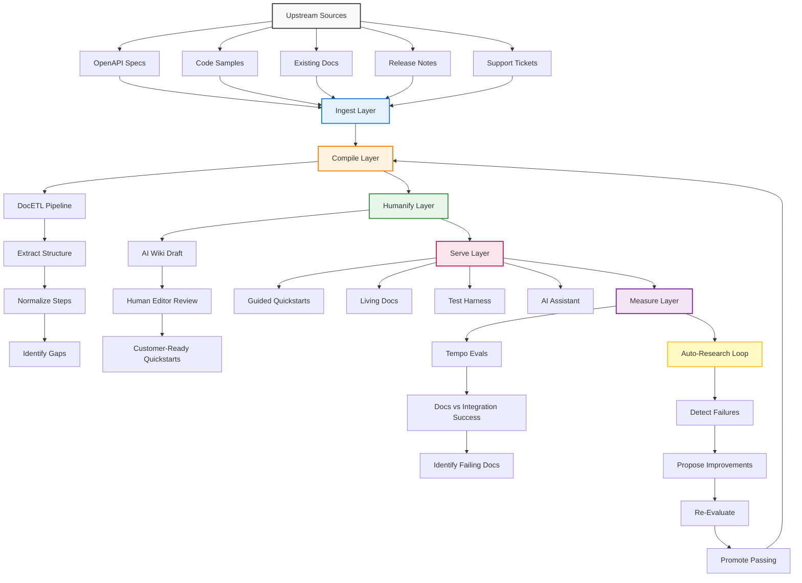

# Relay Product Spec: Integration Success OS

## 1. Customer outcome (working backwards)

**Customer promise:**  
"A developer can integrate our API in a single session, with clear steps, working code, and a go-live checklist, and their first successful transaction happens within hours, not days."

**Success metrics:**
- Time to first successful API call (TTFSC) < 4 hours.
- % of developers who complete integration without support tickets > 80%.
- Reduction in "how do I…" support volume by > 40%.
- Increase in production-ready integrations per quarter by > 2x.

---

## 2. Product features that deliver this outcome

### 2.1 Guided integration quickstarts

- Role-based quickstarts (backend, frontend, mobile, ISV).
- Step-by-step integration flow with:
  - Prerequisites.
  - Auth setup.
  - First API call.
  - Test scenarios.
  - Go-live checklist.
- Embedded code samples that match the user's language/framework.

### 2.2 Living integration docs

- Docs that auto-refresh when:
  - OpenAPI specs change.
  - SDKs or samples are updated.
  - Release notes indicate breaking changes.
- "Last verified" timestamp on every integration page.
- Visual diff for changes that affect integration.

### 2.3 Integration test harness

- Pre-built test scenarios for:
  - Happy path.
  - Common error cases.
  - Auth and security checks.
- Automated validation that code samples actually work.
- "Test in sandbox" button that runs tests against the developer's own credentials.

### 2.4 Humanified AI wiki

- AI-generated integration wiki from specs, code, and existing docs.
- DocETL pipeline to:
  - Extract structure.
  - Normalize steps.
  - Identify gaps.
- Human editors review and refine AI wiki into customer-ready quickstarts.

### 2.5 Continuous eval and improvement

- Tempo-based evals that:
  - Compare docs vs actual integration success.
  - Track which docs correlate with successful integrations.
  - Identify docs that cause confusion or failures.
- Autoresearch loop to:
  - Detect failing integrations.
  - Propose doc or sample improvements.
  - Re-evaluate and promote only improvements that pass.

---

## 3. Architecture overview

### 3.1 High-level flow

```
[Upstream Sources]
  ↓
[Ingest]
  ↓
[Compile]
  ↓
[Humanify]
  ↓
[Serve]
  ↓
[Measure]
  ↓
[Auto-Research Loop]
  ↺
```

### 3.2 Detailed architecture diagram



---

## 4. Component details

### 4.1 Ingest Layer

**Responsibilities:**
- Fetch OpenAPI specs, code samples, existing docs, release notes, and support tickets.
- Snapshot versions for reproducibility.
- Track source freshness and ownership.

**Interfaces:**
- `ingest_source(source_id)`
- `fetch_snapshot(source_id, version)`
- `diff_snapshots(source_id, from_version, to_version)`

### 4.2 Compile Layer (DocETL)

**Responsibilities:**
- Extract structured knowledge from raw docs.
- Normalize integration steps across products.
- Identify gaps in coverage or clarity.

**DocETL pipeline stages:**
1. **Extract:** Pull out endpoints, auth requirements, parameters, examples.
2. **Transform:** Normalize into common step format.
3. **Reduce:** Cluster similar steps across products.
4. **Validate:** Check for missing prerequisites or error cases.

**Example DocETL operation:**

```yaml
extract_integration_steps:
  operation: map
  input: docs
  prompt: |
    Extract integration steps from this document.
    For each step, identify:
    - Prerequisites
    - Action
    - Expected outcome
    - Common errors
  output: structured_steps
```

### 4.3 Humanify Layer

**Responsibilities:**
- Convert AI-generated wiki into customer-ready content.
- Ensure tone, clarity, and completeness.
- Add product-specific nuance.

**Workflow:**
1. AI generates draft wiki from compiled knowledge.
2. Human editors review and refine.
3. Approved content becomes the canonical quickstart.
4. Edits are tracked and fed back into the autoresearch loop.

### 4.4 Serve Layer

**Responsibilities:**
- Deliver quickstarts, living docs, and test harness to customers.
- Support AI assistant context retrieval.
- Ensure brand-specific rendering.

**Outputs:**
- Guided quickstarts (web).
- Living docs (auto-refreshing).
- Test harness (interactive).
- AI assistant context packs.

### 4.5 Measure Layer (Tempo Evals)

**Responsibilities:**
- Run integration scenarios against docs.
- Track success/failure rates.
- Identify docs that correlate with failures.

**Eval types:**
1. **Schema validation:** Are required fields present?
2. **Content validation:** Are steps accurate and complete?
3. **Integration validation:** Do code samples actually work?
4. **Customer success validation:** Do users complete integration?

**Tempo eval example:**

```yaml
eval_integration_success:
  case_id: quickstart_001
  user_query: "Integrate payment API"
  expected_doc_types: [quickstart, api_reference, auth_guide]
  success_criteria:
    - User completes first API call
    - No support tickets filed
    - Time to completion < 4 hours
```

### 4.6 Auto-Research Loop

**Responsibilities:**
- Detect failing integrations.
- Propose doc or sample improvements.
- Re-evaluate and promote only improvements that pass.

**Loop stages:**
1. **Detect:** Tempo evals identify failing docs or samples.
2. **Propose:** Autoresearch agent suggests improvements.
3. **Re-Evaluate:** Tempo re-runs evals on improved content.
4. **Promote:** Only passing improvements become canonical.

---

## 5. Customer journey

### 5.1 Before Relay

- Developer reads static docs.
- Docs may be stale or incomplete.
- Code samples may not work.
- Integration takes days.
- Support tickets filed for common issues.

### 5.2 After Relay

- Developer opens guided quickstart.
- Steps are current, tested, and complete.
- Code samples are verified to work.
- Integration takes hours.
- Support tickets reduced by > 40%.

---

## 6. Success metrics

| Metric | Target | Measurement |
|--------|--------|-------------|
| Time to first successful API call | < 4 hours | Analytics + survey |
| % completing integration without support | > 80% | Support ticket data |
| Reduction in support volume | > 40% | Ticket volume comparison |
| Increase in production integrations | > 2x | Quarterly integration count |
| Doc accuracy (Tempo eval score) | > 90% | Automated evals |

---

## 7. Roadmap

### Phase 1: Core ingestion and compilation

- Ingest OpenAPI specs, code samples, existing docs.
- DocETL pipeline for extraction and normalization.
- AI wiki generation.

### Phase 2: Humanification and serving

- Human editor review workflow.
- Guided quickstarts and living docs.
- AI assistant context packs.

### Phase 3: Measurement and improvement

- Tempo evals for integration success.
- Auto-research loop for continuous improvement.
- Test harness for interactive validation.

### Phase 4: Expansion

- Multi-product support.
- Brand-specific rendering.
- Persistent session memory for multi-day integrations.

---

## 8. Risks and mitigations

| Risk | Mitigation |
|------|------------|
| AI-generated content is inaccurate | Human review layer + Tempo evals |
| Docs become stale again | Auto-refresh on spec changes |
| Code samples don't work in practice | Test harness + integration validation |
| Autoresearch loop makes things worse | Eval-gated promotion only |
| Multi-brand complexity | Brand overlay layer + validation gates |

---

## 9. Open questions

- Which products should be first for integration success OS?
- How many human editors are needed for humanification?
- What is the minimum viable Tempo eval set?
- Should we add persistent session memory in Phase 1 or Phase 4?

---

## 10. Appendix: Example quickstart structure

```yaml
quickstart:
  title: "Integrate Payment API"
  audience: "backend_developer"
  prerequisites:
    - API key
    - Sandbox account
    - Node.js 18+
  steps:
    - title: "Install SDK"
      action: "npm install @relay/acceptance-sdk"
      expected_outcome: "SDK installed"
    - title: "Initialize client"
      action: "const client = new AcceptanceClient({ apiKey: 'YOUR_KEY' })"
      expected_outcome: "Client initialized"
    - title: "Make first API call"
      action: "await client.payments.create({ amount: 100, currency: 'USD' })"
      expected_outcome: "Payment created"
    - title: "Test in sandbox"
      action: "Run test suite"
      expected_outcome: "All tests pass"
    - title: "Go live"
      action: "Switch to production credentials"
      expected_outcome: "Production payment created"
```
